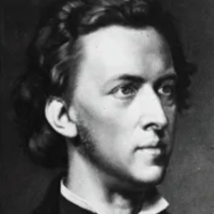
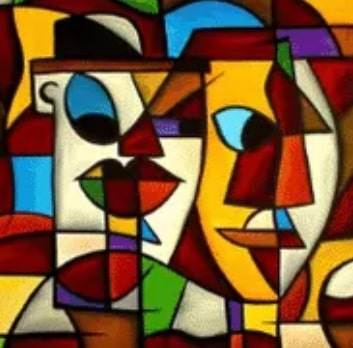
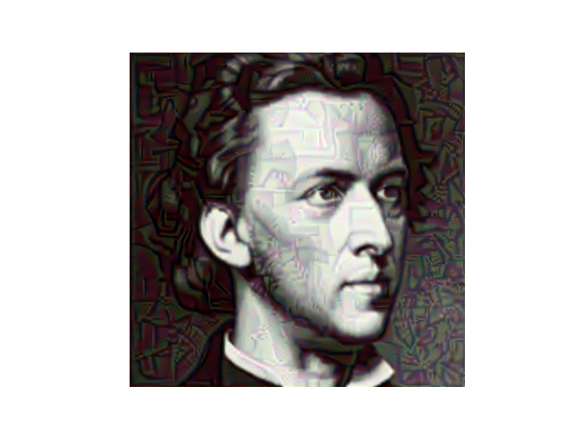

# 🎨 Neural Style Transfer using PyTorch

This project applies artistic styles from famous paintings to regular photographs using deep learning techniques, specifically with a pre-trained VGG19 model in PyTorch.

## 📌 Objective

Implement a neural style transfer system that can take two images — a **content image** (e.g., a photo of a person or landscape) and a **style image** (e.g., a Van Gogh painting) — and blend them together so that the output image looks like the content image painted in the style of the style image.

## 🛠️ Technologies Used

- Python 🐍
- PyTorch 🔥
- VGG19 Pretrained CNN
- PIL & Matplotlib for image handling

## 🖼️ Example Output

**Content Image** | **Style Image** | **Stylized Output**
:----------------:|:--------------:|:------------------:
 |  | 

## 🚀 How to Run

1. Clone this repository:
   ```bash
   git clone https://github.com/<your-username>/neural-style-transfer.git
   cd neural-style-transfer
